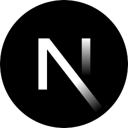
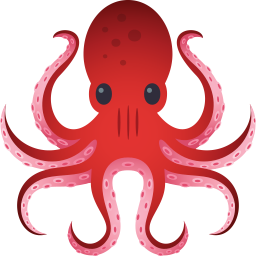
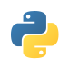

<h1> Hey 👋, I'm Andrés Guano!</h1>

  
  

 
 

💻 Highly motivated and enthusiastic frontend web developer. 

🤝 Excellent team player and passionate for building good working relationships as well as learn from others.

👨‍💻 Dedicated and organized, ready to undertake new challenges and help to solve difficult problems.
 

  
### 🧐 More About Me:

- 🔭 &nbsp; I’m currently **open to work**
- 🌱 &nbsp; I’m currently learning React Native and Qwik; 
- 💬 &nbsp; Ask me about anything tech related, I am happy to help;
- 📫 &nbsp; Feel free to ping me on [LinkedIn](https://www.linkedin.com/in/andres-guano-valencia/?locale=en_US)
<!-- - 📝 &nbsp; Checkout my [resume]() -->
 
 
 
 
 

### 🔨 Languages and Tools:

  
  
  
  
  
  
  
  
  
  
  
  
  
  

 

### 📊 Github Stats

 
